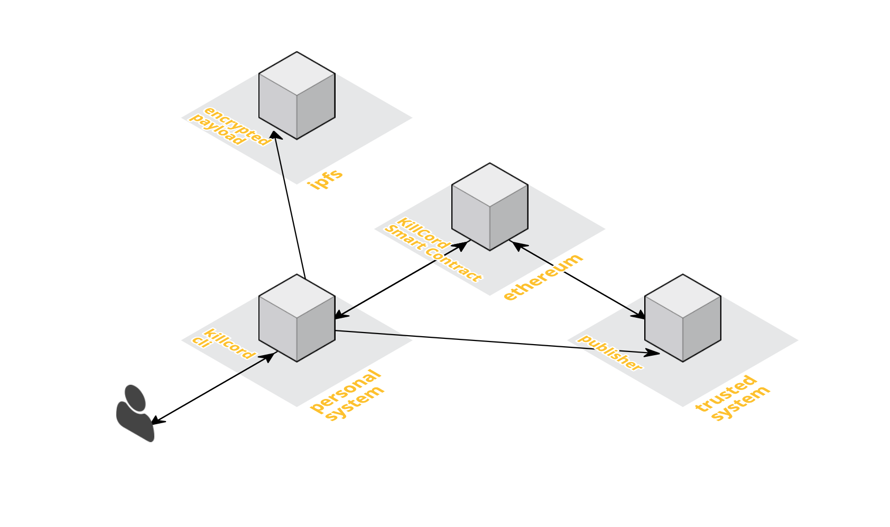

# killcord

## v0.0.1

[![circleci][1]][2]

[1]: https://circleci.com/gh/nomasters/killcord.svg?style=shield&circle-token=46ac657a268fef44dc132ef2241291c51811edd2
[2]: https://circleci.com/gh/nomasters/killcord


**WARNING** This software is in early _alpha_. Please do not rely on this with your life. Though great care has been taken to ensure that this code is well structured and a straight-forward as possible, it has not undergone proper peer-review and could have both minor and major bugs that undermine the integrity of the system.


## Summary

`killcord` is an early prototype of a censorship resistant [dead man's switch](https://en.wikipedia.org/wiki/Dead_man%27s_switch) for revealing the cryptographic key to a publicly accessible encrypted payload. 



`killcord` leverages: 

- [ipfs](https://ipfs.io/) for decentralized, immutable, peer-to-peer storage of the encrypted payload
- [an ethereum smart contract](https://solidity.readthedocs.io/en/develop/introduction-to-smart-contracts.html) for immutable and censorship resistant application state.
- a hidden `publisher` written in `go` that communicates with the `ethereum` smart contract and publishes the `ipfs` stored encrypted payload key in the event that the `killcord` owner stops checking in.
- a client `killcord cli` written in `go` meant to run on a personally controlled system that bootstraps the entire `killcord` system and allows for checkins.

### killcord overview

`killcord` is designed for a project owner to be able to automatically release a decryption key in the circumstance that the owner stops _checking-in_ after a predefined window of time. This allows an owner to release a secret data dump to the public in the event of death or disappearance.

- It leverages `ipfs` for its censorship resistance and the ability to cheaply and efficiently hold and share data sets of an arbitrary size.

- It leverages **ethereum smart contracts** as the backbone to the `checkin` and `publish` system. The killcord smart contract holds the **source of truth** for the ipfs `storageEndpoint` hash, the `lastCheckIn` data, and the `publishedKey`, in the event that the secret key is published.

- It leverages a `publisher` tool meant to run autonomously on a trusted system or set of systems. In its current form, it runs under a special `publisher` identity. The publisher watches the smart contract for the `LastCheckin` state and follows a set of publication rules. For example, if the `publisher` is configured to publish in the event that the `LastCheckIn` was greater than 48 hours from the current time, the `publisher` would attempt to publish the `decryptionKey` for the IPFS payload to the smart contract. The `publisher` is portable enough to run on a raspberry pi and even has an [aws lambda](https://aws.amazon.com/lambda/) handler so that it can be scheduled on lambda for virtually no cost.

### killcord client (CLI)

To install killcord, you can download precompiled binaries from latest release from the releases tab on github. Once downloaded, move `killcord` to your path, such as `/usr/local/bin/`.


If you have `go` installed, you can install the killcord cli tool by running:

```
go get github.com/nomasters/killcord/killcord
```


`killcord` is a command-line tool meant to run from a personally trusted system. It is the primary interface to either `own` or `watch` a `killcord project`.


***killcord projects*** allow an `owner` to upload an encrypted payload to IPFS with a globally unique `hash` that is tied to a smart contract on ethereum. `killcord` creates unique `ipfs` and `ethereum` accounts for each project (one for the contract owner and one for the publisher), and once a small amount of `ETH` has been added to the newly generated account, it deploys a smart contract closely tied to the `owner` of the account. Only the account owner is allowed to make writes to all functions on the smart contract, the publisher is only allowed to my writes on the `publishedKey` function.

The owner can interact with the project, once deployed with:

- **checkin** - a command used to let `killcord` know the owner is still around
- **status** - a command used to check the status of the existing contract
- **publish** - the command used to bypass the `publisher` and post the decryption key to the smart contract.


#### Running killcord as an owner

With `killcord`, the project owner has a special status. A project owner controls the initialization, deployment, and updating steps involved in a `killcord project`. 

Killcord projects have all of the configurations contained within the project directory. This includes all account information, secrets, and environmental variables related to the `killcord project`. This allows you to run multiple killcord projects as an owner or a watcher as you see fit.

To create a new `killcord project` as an owner, create an empty directory for the project.

```
$ mkdir my-example-killcord
$ cd my-example-killcord

```
then you will want to initialize the project that defaults to the `ropsten` testnet on ethereum.
```
$ killcord init --dev
```

This will setup a `killcord.toml` configuration file that includes 2 new ethereum accounts. The first account is your `owner` account. This is the account that owns the contract on ethereum and it is tied to the owner project on your personal system. The second account is for your publisher. This is a special account with lower privileges that is only allowed to publish your key to the contract.

Once created, you will be given instructions on the owner and publisher accounts addresses that needs ETH to move forward. You should fund this account with ETH before moving forward. 

Since we are running this project on the `testnet` you can get free ETH to test by installing [metamask](https://metamask.io/) and requesting some ETH from the [MetaMask Ether Faucet](https://faucet.metamask.io/). 

NOTE: 1 ETH is more than enough to experiment with `killcord`

Before you continue, check your killcord account balances with the `status` command

```
$ killcord status
```

Once your owner account is funded, you should deploy your contract:

```
$ killcord contract deploy
```

This will deploy the smart contract for your killcord project in an incomplete state. A contract needs to be linked to an ipfs encrypted payload before it is ready to be monitored by the publisher.


#### preparing your payload

The encrypted data payload for killcord utilizes [NaCL secretbox](https://nacl.cr.yp.to/secretbox.html) to encrypt a single-file payload. This file uses a 256 bit key that is randomly generated and saved inside of the project to be utilized by either the owner or publisher.

Place your files in the `payload/source` folder in your project. If `killcord` recognizes multiple files in this directory, it will automatically zip these files for you before encrypting it.

```
$ killcord encrypt
```

This command encrypts your data, saves it into the `payload/encrypted` directory and saves the encryption key to the `killcord.toml` file.

to test that they payload will decrypt properly, use: 

```
$ killcord decrypt
```

This will decrypt a payload found in the `payload-encrypted` directory and save it to the `payload-decrypted` directory. This should match the contents of the `payload-source` directory.

Now that we have an encrypted payload, we need to deploy it to `ipfs`. run:

```
$ killcord payload deploy
```

This adds the encrypted payload to `ipfs`, it writes the `ipfs` hash to you project configuration. Then, it updates your smart contract so that it is able to reference the IPFS hash as well.

#### an important consideration about deploying your payload to IPFS

`ipfs` is a decentralized permanent web. This means that anything posted there has a high likelihood of sticking around permanently. Existentially this means that killcord payloads should be treated very carefully. Payloads that exist should be intended for the public. This can't be overstated.

Reasons that a payload could be decrypted before you intend it to be:

- there is a flaw in `secretbox` that exposes a vulnerability in the encryption
- there is a flaw in the killcord implementation of `secretbox` that exposes a vulnerability in the encryption
- the owner's secret is divulged due to a compromised computer system
- the owner fails to properly fund the owner ethereum account causing the publisher to publish the key
- the owner fails to checkin due to neglect causing the publisher to publish the key

The safest way to think about posting any encrypted payload to IPFS is that it _will_ one day be decrypted. If you are not comfortable with your payload eventually being public, you should not use this tool.

### checking in

You now have a fully configured `owner` account. We still need to configure a `publisher` that will publish on your behalf in the event that you stop checking in, but first, let's checkin before moving forward:

```
killcord checkin
```

This is the primary action the `owner` will take from this point forward. A checkin engages the smart contract with the owner account. Under the hood, the smart contract grabs the `block.timestamp` of the block this transaction is part of and writes that timestamp to the `lastCheckIn` variable. It is important to note that ethereum allows a timestamp drift of up to 900 seconds (15 minutes) by the miner, so it is important to keep this in mind when creating your Publisher, any timestamp can be +/- 15 minutes from reality. By default `killcord` uses a publish threshold of 48 hours.

### check status

You can get your `lastCheckin` recorded to the block chain at any time by running:

```
killcord status
```

### killing a contract

```
killcord contract --kill
```

This kills the contract. Once a contract is killed, it cannot be undone, the owner would have to start a new project to continue.

#### an important consideration about killing contracts

It is important to note that though the contract and its variables will no longer be available, analysis tools for the blockchain that can extract variable state. Killing a contract will stop the contract from mutating in the future, but it will not delete old data. Data posted to your killcord contract is permanently stored on the ethereum blockchain.

### publish (owner override)


```
killcord publish
```

This bypasses the automated publisher and publishes the decryption key for the contract.


### configuring a watcher

A watcher is a non-privileged killcord project that downloads a local copy of the encrypted payload and watches the contract for the publication of a secret.

To start a watcher project create a new directory for the project

```
$ mkdir my-example-killcord-watcher
$ cd my-example-killcord-watcher

```

Initialize the watcher, since our example above used the `testnet` we'll use the testnet here as well.

```
$ killcord watch 0x1dc634148b6d6537e95c26ddaabfc19e0f30e876 --dev
```

if the payload secret is already written to the contract, killcord will write the secret to the config on project creation, simply run

```
killcord decrypt
```

to see the payload.

If the project has not yet published its key, simply run

```
killcord status
```

this will give the watcher an update of the contract status, if the key is published, `status` will write the payload secret to the configuration file and notify the watcher that the secret was published.

### configuring the publisher

Currently, this is the least mature part of killcord and requires a bit of manual configuration. This is slated to change over the next few releases, but this section will outline what it will take to get a publisher running.

The publisher requires a subset of values from the `killcord.toml` to work. 

```
devMode = true             # optional, defaults to false

[payload]
  secret = "SECRET"
  rpcUrl = ""              # optional, defaults to infura

[contract]
  id = "CONTRACT"          
  mode = "testnet"         # optional, defaults to mainnet
  rpcUrl = ""              # optional, defaults to infura
  [contract.publisher]
    address = "HASH"
    password = "PASSWORD"
    keystore = "KEYSTORE"
[publisher]
  warningThreshold = 0     # optional, defaults to 24 hours
  publishThreshold = 0     # optional, defaults to 48 hours
```


These settings can also be expressed as environmental variables.

Required fields are:

```
KILLCORD_PAYLOAD_SECRET 
KILLCORD_CONTRACT_ID
KILLCORD_CONTRACT_PUBLISHER_ADDRESS
KILLCORD_CONTRACT_PUBLISHER_PASSWORD
KILLCORD_CONTRACT_PUBLISHER_KEYSTORE
```

Optional fields are:

```
KILLCORD_DEV_MODE                       \\ defaults to false
KILLCORD_PUBLISHER_WARNING_THRESHOLD    \\ defaults to 24 hours if not included
KILLCORD_PUBLISHER_PUBLISH_THRESHOLD    \\ defaults to 48 hours if not included
KILLCORD_PAYLOAD_RPCURL                 \\ defaults to infura.io
KILLCORD_CONTRACT_RPCURL                \\ defaults to infura.io
```

To run the publisher one time from inside of the owner project, you can simply run

```
killcord publisher run
```

this runs the publisher and defaults to returning a warning if it has been 24 hours since the last checkin and defaults to publishing the payload secret after 48 hours from the last checkin.

You can manually change these thresholds in the `killcord.toml` file or by setting the ENV_VARs outlined above.

### scheduling the publisher

Once a publisher is configured, the next step will be to schedule its runs. Currently there is no automatic way of doing this, but there are several solutions in the works including easy deploy tools for `docker` and `aws lambda`, and they are actively being worked on.

Without any special setups, `killcord publisher run` can be scheduled with common unix tools such as `cron`.

Killcord also provides an ***aws lambda*** handler, and an example project leveraging [apex.run](http://apex.run/) is in the `examples/` directory in this repo

### Connecting your own ETH and IPFS nodes to killcord

By default `killcord` uses [infura](https://infura.io/) to make connections to ethereum and IPFS effortless, but if you are a more advanced user, you are encouraged to participate in hosting your own decentralized nodes. 

There are two ways to wire up custom RPC endpoints

- add the RPC endpoint to the `killcord.toml` config file
- configure environmental variables for `KILLCORD_CONTRACT_RPCURL` and `KILLCORD_PAYLOAD_RPCURL`

## getting involved

If you find this project interesting, I'd love your help. you can reach [me on keybase](https://keybase.io/rjrbt) or even better, join the [killcord group chat on keybase](https://keybase.io/team/killcord).