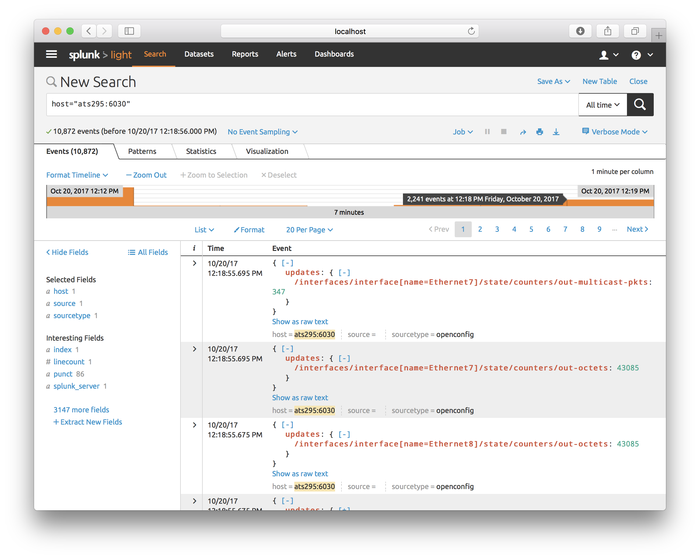

# ocsplunk

Client for the gRPC OpenConfig service which subscribes to the configuration and
state of a network device and sends it to the Splunk HTTP Event Collector.

## Sample usage

```
ocsplunk -addr 10.0.1.2 -splunkurls https://splunk:8088 -splunktoken 00000000-0000-0000-0000-000000000000
```


